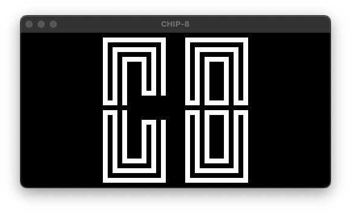

# CHIP-8

CHIP-8 interpreter written in Go.



## Setup

This project requires Go 1.20+ and [SDL2](https://www.libsdl.org/) (via [go-sdl2](https://github.com/veandco/go-sdl2)). Make sure to install all the [system dependencies](https://github.com/veandco/go-sdl2?tab=readme-ov-file#requirements) necessary to run SDL2.

To build CHIP-8, simply run `make`. This will build an executable file `chip8` in the `bin` directory of the project.

## Usage

The program takes in as an argument the path to a CHIP-8 ROM file.

```shell
$ ./chip8 <path to ROM>
```

For example,

```shell
$ ./chip8 Logo.ch8
```

Additionally, the program supplies command-line flags for configuring CHIP-8:

```log
  -scale int
    	set the scaling factor of the screen (default 8)
  -tps int
    	set the number of CPU ticks per frame (default 12)
```

### Key Mapping

The following shows the keys that are virtually mapped to the CHIP-8 keypad:

```log
   Key               Hex
|1|2|3|4|         |0|1|2|3|
|Q|W|E|R|  ---->  |4|5|6|7|
|A|S|D|F|         |8|9|A|B|
|Z|X|C|V|         |C|D|E|F|
```

Additionally, there are other keys for controlling CHIP-8:

| Key       | Control                     |
| ----------| --------------------------- |
| `<Space>` | Toggle pause                |
| `<Esc>`   | Quit                        |
| `;`       | Reset                       |
| `,`       | Execute cycle (when paused) |

## References

- [CHIP-8 - Wikipedia](https://en.wikipedia.org/wiki/CHIP-8)
- [Cowgod's CHIP-8 Technical Reference](http://devernay.free.fr/hacks/chip8/C8TECH10.HTM)
- [Guide to making a CHIP-8 emulator](https://tobiasvl.github.io/blog/write-a-chip-8-emulator/#specifications)
